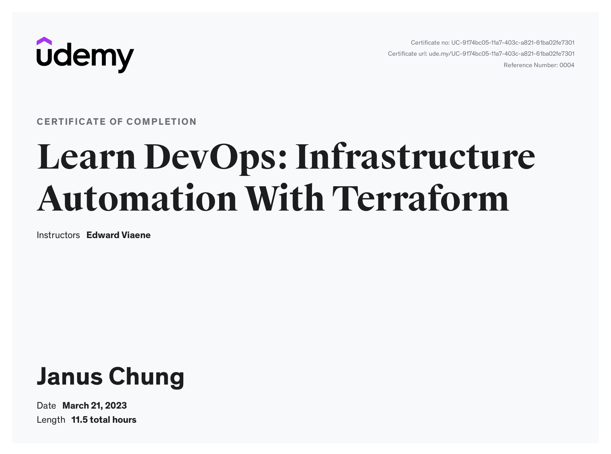
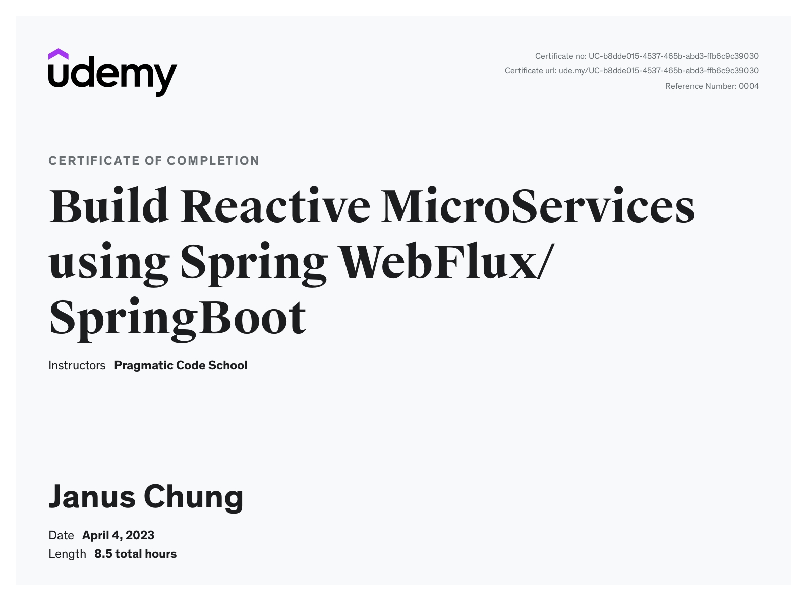

### Learn DevOps: Infrastructure Automation With Terraform
{ width="500" }

- [Terraform course material](https://github.com/wardviaene/terraform-course)

### The Complete GitHub Actions & Workflows Guide
{ width="500" }

- [GitHub Documentation](https://docs.github.com/en/actions)
- [Simple Docke NodeJs API repo](https://github.com/alialaa/simple-docker-nodejs-api)
- [Send Slack Message with Docker](https://hub.docker.com/r/technosophos/slack-notify/)
- [Surge - Service to deploy and test static website](https://surge.sh/)
- [Semantic Versioning](https://semver.org/)

### Argo CD Essential Guide for End Users with Practice
{ width="500" }

- [ArgoCD GitHub Repo](https://github.com/argoproj/argo-cd/)
- [Example App](https://github.com/mabusaa/argocd-example-apps)

### Build Reactive MicroServices using Spring WebFlux/SpringBoot
{ width="500" }

- [Course GitHub Repo](https://github.com/dilipsundarraj1/reactive-spring-webflux/tree/final)

### Become a SuperLearner® 2: Learn Speed Reading & Boost Memory
{ width="500" }

### Apache Kafka Series - Learn Apache Kafka for Beginners v3
{ width="500" }

- [Kafka basics from Conduktor.io](https://www.conduktor.io/kafka/kafka-fundamentals/)

- [Sample Code](https://github.com/conduktor/kafka-beginners-course)