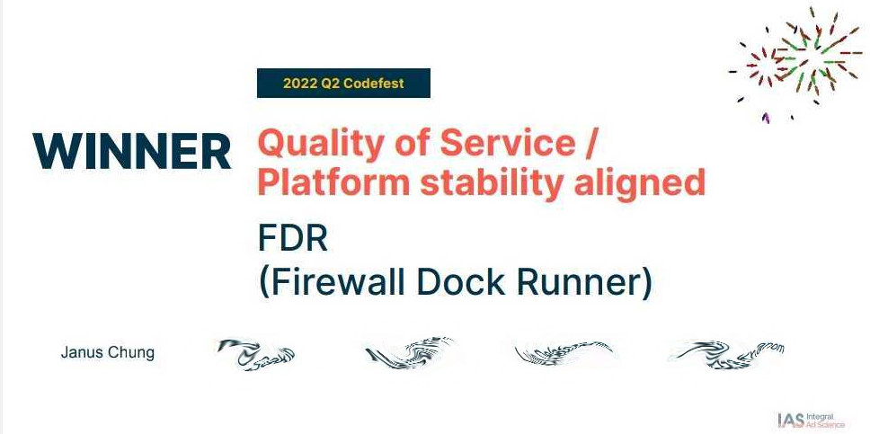
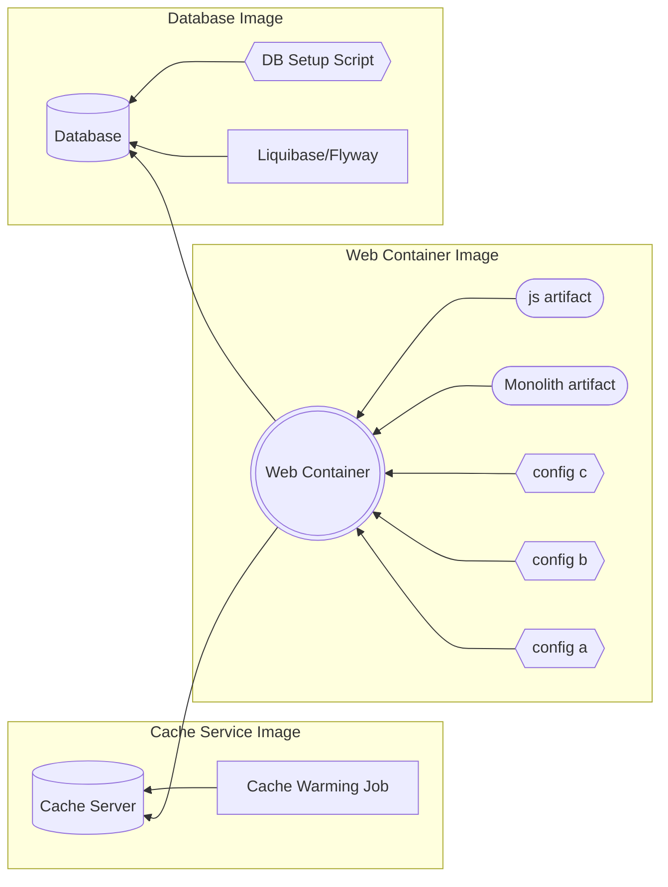

# Hackathon Champion

It was one of my best achievement in career to win the company hackathon leading a team of five engineers from different team across the company.



## Background
It began with the time when I was bored working as a *QA Automation Engineer* in the company for 4 years and I would like to do more outside of my conform zone.
!!! info inline end "I was bored"

    Working as a QA Automation Engineer with day to day repetitive tasks was very boring. I was looking for new challenge.
In a quarterly PI planning, when all of the engineers around the world came to the NYC office, I told my team lead that I wanted to install our flagship platform on my laptop as a local development environment so that I can learn more about how it worked. He pointed me to a Confluence page with instruction that took *20 scrolls* to reach the end.

#### Prerequisite
1. Java
1. Web container
1. Database
1. Cache server
1. Five internal repo


After that came with lengthy instruction to setup configurtation for various servers and repo

#### Configuration
1. Web container configuration
1. Java Spring properties
1. Application configuration
1. Database configuration
1. Script to prepopulate cache
1. download third party files
1. 10+ more things
!!! danger end inline "A whole week to setup"

    It took an average of a week to setup the monolith for new hired. New hires were asking for help in the support slack channel desperately.
That was a tedious process and _it took me 2 days_ to set it up! During the process, I had to consult with *three* different senior developers. It turned out that I found at least two outdated instructions from the Confluence page.

Not ideal.

From that point, I spent a week of free time trying to simplify the installation. I did not want anyone to suffer anymore, especially for the new hires. I tried to Dockerize the monolith plaform. However, I failed due to my lack of domain knowledge from a development standpoint. Besides, my Docker skill was still green.

## Hackathon



Two years later, after I transferred into a development and devops role, the Hackathon came. While brainstorming with a devops buddy for potential team idea, he challenged me to Dockerize the monolith platform. That reignited my hidden burning desire and was a no brainer to give it another try.

## Easy First Draft
At first, I thought it would be hard since I failed two years ago. However, it turned out to be a 2 hours easy work for the first working draft!

When I think back now, here were the reasons:

1. The database, an important part had already been containerized in those two years. It was a team effort between another developer and me with our free time.

1. I gained more domain knowledge of the monolith plaform. What didn't make sense from the server and application logs in the past became meaningful during the troubleshooting process.

1. I was more familiar with most of the configuration files and fields since I had been working on the codebase for the past two years.

1. My Docker skill had grown so much from the work as well as from the home server setup that I did during my free time.

The first draft was working with the following setup:

1. Database in a Docker
1. Local cache server with warming up script ran manually
1. The monolith Java war file in a Docker web container with required configuration files
1. The monolith was setup to wire with the database in Docker and the local cache server

It worked! Since I had one and half day left, I spent the rest of the time to automate everything together. My plan was to have the monolith be brought up with a single command.

## Final Draft

I continuted to Dockerize other components, including the cache server and its cache warmup process. I also made the new repo as the single source of the truth for all the configuration files. Here is the final docker-compose file (with some naming modification):

``` yaml
version: '2.3'

networks:
  internal:
    driver: bridge
    ipam:
      driver: default
      config:
        - subnet: 172.16.238.0/24

services:
  service-a:
    image: the-cache-server
    ports:
      - "22122:22122"
    networks:
      internal:
        ipv4_address: 172.16.238.2
  db:
    image: internal-cr/the-db-image:latest
    init: true
    ports:
      - "1234:1234"
    networks:
      internal:
        ipv4_address: 172.16.238.3
  monolith:
    image: internal-cr/monolith:latest
    ports:
      - "9090:9090"
      - "9091:9091"
    depends_on:
      - service-a
      - db
    volumes:
      - ./etc/webcontainer/:/etc/webcontainer/
      - ./artifact/monolith/:/usr/local/webcontainer/monolith/
      - ./artifact/monolith-js:/var/data/deploy/monolith-js
      - ./var/data/conf:/var/data/conf
      - ./config:/var/data/config
    hostname: monolith
    networks:
      internal:
        ipv4_address: 172.16.238.4
```

Compared to following a 10 pages Confluence page and two days to setup a local development environment for the monolith, the process became a simple 4 steps task:


1. Build and drop the Java war file to the `artifact/monolith` directory
1. Get the latest monolith-js artifact and drop it to the `artifact/monolith-js` directory
1. Build the Docker image
1. Bring up the monolith with `docker-compose up`


## Follow Up Meeting

{ align=right width=400" }
At that point, I didn't really care much if I would win the hackathon since I've already achieved something that I couldn't do in the past. I also believed that the project will help everyone in the future to get onboard within an hour or two compares to days of tedious manual setup.

However, I understood that if my voice was not being heard, all the effort would just stay as a dead project without really helping anyone.

For that, I made a bold move to call off a meeting with all the related party, plus some big guys:

- Director and Manager of SysOps
- Director of DevOps
- Managers and Tech Leads from two teams
- CTO, VP of Engineering

In an hour of meeting, besides descring what the project has solved and the reason behind it, I brought up the following that the project could potentially solve:

- To migrate the CICD process of the Dockerized monolith application to Kubernetes 
- To run acceptance test and regression in parallel faster with horizontal scaling
- To test web container, java and database update easily

Suprisingly, these were some of the problem which they would like to solve on their roadmap or backlog for the next two years. We ended up creating epics for respective team to further develop the project. It was a big success.

## Hackathon Result

It still feel so surreal and overwhelming to win the hackathon for the company. The most valuable part was that I learned to step up and organize the meetings with the right people to drive cross team collaboratoin and further develop the project. I also gained the trust within the Engineering and Product teams and built great connection and friendship with my teammates and other team members.
