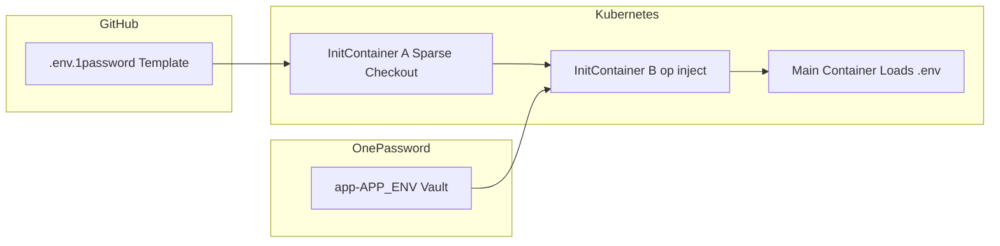

# Migrating From dotenv.org to 1Password in Kubernetes Deployment
##### originally posted at [LinkedIn](https://www.linkedin.com/pulse/migrating-from-dotenvorg-1password-kubernetes-deployment-janus-chung-fvfjc) at November 19, 2025

dotenv.org recently increased its pricing, and at the same time our organization was already consolidating secrets into **1Password** for engineering, operations, and automation workflows. Maintaining a parallel `.env.vault` system became unnecessary and costly — both financially and operationally.


<!-- more -->

This document describes the new approach we adopted:

- No `.env.vault` files
- No Kubernetes Secrets or ConfigMaps
- No Argo CD Vault Plugin
- No manifest edits for configuration changes
- All config **keys** committed to Git (transparent)
- All config **values** stored in 1Password (secure)
- Secrets resolved at pod startup via `op inject`


## What `.env.vault` Looked Like—and Why We Outgrew It

dotenv-vault’s model is clever: commit a single encrypted .env.vault file to your repo, decrypt it at runtime, and ship the result as environment variables. A typical file looks like:

``` yaml
#/-.env.vault/
#/         cloud-agnostic vaulting standard         /
#/   [how it works](https://dotenv.org/env-vault)   /
#/--/

# staging
DOTENV_VAULT_STAGING="encrypted-staging-data"
DOTENV_VAULT_STAGING_VERSION=25

# production
DOTENV_VAULT_PRODUCTION="encrypted-prod-data"
DOTENV_VAULT_PRODUCTION_VERSION=29

# qa
DOTENV_VAULT_QA="encrypted-qa-data"
DOTENV_VAULT_QA_VERSION=27

#/-settings/metadata--/
DOTENV_VAULT="vlt_xxxxxxxx"
DOTENV_API_URL="https://vault.dotenv.org"
DOTENV_CLI="npx dotenv-vault@latest"
```

### The main drawbacks for our team:

Even a single-line edit in any .env.* file means:

- dotenv-vault build
- .env.vault hash changes
- Version numbers (DOTENV_VAULT_<ENV>_VERSION) increase
- Commit the new encrypted blob and redeploy

It’s mechanically correct, but it creates:

- Lots of churn in Git
- Frequent re-encryption cycles
- A manual rebuild step tied to config changes
- Growing diffs containing opaque encrypted blobs

When pricing doubled and we were already migrating the rest of our secrets to 1Password, it was clear that .env.vault was no longer the best long-term option.


## Why We Avoided the Argo CD Vault Plugin

As we moved off dotenv, we considered the **Argo CD Vault Plugin (AVP)**. Ultimately, we rejected it for both architectural and operational reasons.

### Repo-Server Complexity

AVP requires patching the `argocd-repo-server` to add:

- Sidecars or CMP plugins
- Custom binaries
- Additional mounted volumes
- Secrets containing backend credentials

This increases risk during upgrades and complicates Argo CD’s deployment model.

### Plugin-Specific YAML

AVP introduces templating syntax into manifests, such as:

```yaml
metadata:
  annotations:
    avp.kubernetes.io/path: "kv/data/app/prod"
stringData:
  PASSWORD: <password>
```

This couples manifest format to the plugin and leaks backend secret paths into application resources.

### No Automatic Updates for Changed Secrets

Argo CD watches:

- Git (desired state)
- Kubernetes (live state)

It does **not** watch Vault/1Password.

If a secret changes in your backend:

- AVP does not automatically update cluster Secrets
- Hard refresh or manual sync is required

### Argo CD Maintainers Caution Against This Pattern

The Argo CD team explicitly warns that manifest-generation-time secret injection increases complexity and should be used with caution.


## Overview of the New Architecture

The new approach is simple and avoids all the drawbacks above.

### Key Components

- `.env.1password` template stored in Git
- GitHub App with sparse-checkout permissions
- Two initContainers:
  1. Fetch the template
  2. Run `op inject` to generate a real `.env`
- Main container loads `.env` via any standard dotenv library

### Benefits

- All config keys visible in Git
- Values pulled securely from 1Password
- Zero Kubernetes Secrets/ConfigMaps required
- No manifest changes needed for config changes
- One template works across all environments via `$APP_ENV`
- Application developers continue using `.env` formats
- Pods always retrieve fresh secrets when restarted

## Generic `.env.1password` Template

```dotenv
# .env.1password

TZ="op://app-$APP_ENV/TZ/notesPlain"
NODE_ENV="op://app-$APP_ENV/NODE_ENV/notesPlain"
APP_ENVIRONMENT="op://app-$APP_ENV/APP_ENVIRONMENT/notesPlain"
APP_ENV_SHORT="op://app-$APP_ENV/APP_ENV_SHORT/notesPlain"
DATABASE_URL="op://app-$APP_ENV/DATABASE_URL/notesPlain"
REDIS_URL="op://app-$APP_ENV/REDIS_URL/notesPlain"
API_KEY="op://app-$APP_ENV/API_KEY/notesPlain"
THIRD_PARTY_TOKEN="op://integrations-$APP_ENV/THIRD_PARTY_TOKEN/notesPlain"
ANALYTICS_KEY="op://integrations-$APP_ENV/ANALYTICS_KEY/notesPlain"
```

## Kubernetes InitContainer: Fetch Template from GitHub

A GitHub App issues a short-lived installation token and performs a sparse checkout of only the `.env.1password` file.

```yaml
initContainers:
  - name: fetch-template
    image: alpine:3.20
    env:
      - name: REPO
        value: "github.com/ORG/REPO"
      - name: APP_ID
        valueFrom:
          secretKeyRef:
            name: github-app-creds
            key: GITHUB_APP_ID
      - name: INSTALLATION_ID
        valueFrom:
          secretKeyRef:
            name: github-app-creds
            key: GITHUB_INSTALLATION_ID
    volumeMounts:
      - name: workdir
        mountPath: /work
      - name: gh-creds
        mountPath: /gh/private.pem
        subPath: GITHUB_PRIVATE_KEY
        readOnly: true
    command: ["sh","-lc"]
    args: |
      set -euo pipefail
      apk add --no-cache openssl curl jq git
      # git check out the 1password template file
      ...
```

## Kubernetes InitContainer: `op inject` → `.env`

```yaml
  - name: op-inject
    image: 1password/op:latest
    env:
      - name: OP_SERVICE_ACCOUNT_TOKEN
        valueFrom:
          secretKeyRef:
            name: onepassword-service-account
            key: token
    workingDir: /work
    volumeMounts:
      - name: workdir
        mountPath: /work
    command: ["sh","-lc"]
    args: |
      set -euo pipefail
      APP_ENV={{ .Values.environment }} \
        op inject -i .env.1password -o .env
      chmod 0440 .env
```

## Main Container Loading the `.env`

```yaml
containers:
  - name: app
    image: your-app:latest
    volumeMounts:
      - name: workdir
        mountPath: /app/env
    env:
      - name: DOTENV_PATH
        value: /app/env/.env
```

## Flow Diagram



## Advantages Summary

| Capability | dotenv.org | AVP | 1Password + InitContainers |
|-----------|-----------|-----|----------------------------|
| Config keys visible in Git | ❌ Hidden | ⚠️ Mixed | ✅ Yes |
| Values stored securely | ⚠️ Encrypted blob | ⚠️ In K8s Secrets | ✅ 1Password |
| Requires patching Argo CD | ❌ | ✅ Yes | ❌ |
| Detects secret changes | ❌ Rebuild needed | ❌ Hard-sync needed | ✅ Pod restart = fresh |
| Kubernetes Secrets required | ❌ | ✅ Yes | ❌ |
| Manifest edits for config changes | ✅ Yes | ⚠️ Sometimes | ❌ Never |
| Developer experience | Medium | Plugin-dependent | Excellent |

## Conclusion

This migration allowed us to standardize on a single secrets platform (1Password), remove unnecessary components (dotenv vaulting, Kubernetes Secrets, AVP), and simplify both developer and operational workflows.

Key benefits:

- No encrypted blob churn in Git  
- No manifest changes for config changes  
- All config keys visible in Git; all values in 1Password  
- Deterministic, environment-agnostic template  
- Simple and reliable pod-startup secret injection  
- Argo CD stays unmodified and secure  
