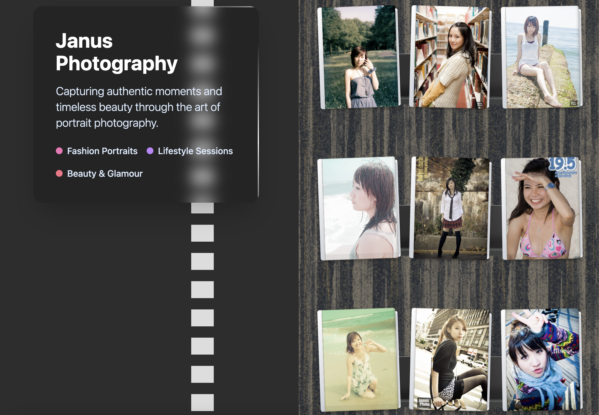

# The DevOps Odyssey, Part 5: Migration of Job Winner and Release of the Photo App
##### originally posted at [LinkedIn](https://www.linkedin.com/pulse/devops-odyssey-part-v-migration-job-winner-release-photo-janus-chung-oaoyc/) at Oct 23, 2025

In [Part 4](./2025/08/31/the-devops-odyssey-part-4-secrets-github-auth-and-scaling-out/), I closed with a simple plan: migrate *Job Winner* into the cluster and build a photo app that would reconnect my creative and technical worlds. Those two threads finally came together — one practical, one personal — and in the process, the Odyssey took another quiet but meaningful turn.

<!-- more -->

## From Docker Compose to Helm  
When I first deployed *Job Winner* months ago, it lived alone — running inside Docker Compose on a single Oracle Cloud VM, wired up with Traefik and DuckDNS. It worked, and it worked well. But as the system grew, each new service meant another `docker-compose.yml`, another CI workflow, another layer to keep aligned. It wasn’t hard — just fragmented. Adding one more app meant adding one more pattern to maintain. It became clear that what I needed wasn’t more automation, but **unification** — a single way to deploy everything, no matter what it was.

That same service now runs inside **K3s**, deployed through its own **Helm chart**, synchronized by **Argo CD**, and fully self-managed. The application hasn’t changed much, but the way it exists has. Every configuration is now declarative. Every environment variable, every ingress path, every secret — sealed, versioned, and reconciled automatically.  

Migrating it was not an act of reinvention but of *discipline*.  
I didn’t chase new features or frameworks; I just removed friction.  
The build pipeline that once targeted Docker Compose now outputs a Helm release. The cluster applies it, observes it, and ensures it stays the way it should be.  

The difference shows not in performance, but in posture.  
The system no longer waits for me to correct it — it corrects itself.  

## Shutting Down to Reclaim Compute  

The old VM that used to host *Job Winner* has served well through the early chapters — from Terraform provisioning to Docker experimentation. But now, it’s time to let it rest.  

Rather than leave it idle or pay the hidden cost of unused allocation, I chose to **shut it down with Terraform**, releasing the compute back to Oracle OCI’s free-tier pool. The infrastructure state remains preserved in Git, so when I need more capacity — a build node, or another worker for heavier workloads — I can bring it back online with a single `terraform apply`.  

There’s something satisfying about that symmetry:  
what once took hours of manual setup can now be undone — and redone — declaratively.  

It’s a small but important evolution. “Scaling down” is part of the same maturity as scaling up. Automation is not only about elasticity in expansion, but also in retraction.  

When you treat every resource as code, *deletion* becomes an elegant act — a form of stewardship.  

So the freed compute is no longer waste; it’s a reserve. A future node, waiting in potential energy.  

## The Photo App — Where Code Meets Memory  

The second thread of this chapter is personal.  
I finally released a [**photo app**](https://janusc.duckdns.org/photo) that runs in the same cluster — a minimal single-page site that displays work from my earlier years behind the camera. Albums sit on a virtual shelf, flipping through pages with a small kinetic animation. Underneath, it’s pure infrastructure: static files served by Kubernetes, cached by Traefik, observed by Argo CD, and backed by the same sealed-secret discipline as everything else.  

Technically, it’s trivial. Emotionally, it’s the most meaningful deployment I’ve done so far.  

For years, my creative archive lived in folders — external drives, forgotten S3 buckets, somewhere between nostalgia and neglect. Now, the images resurface through a pipeline that speaks the language I live in today. Git commits instead of Lightroom catalogs. CI pipelines instead of export queues.  

It’s a strange fusion — photography, DevOps, and Kubernetes.  
But it works.  

What I used to call a “shoot” has become a “release.”  
What was once a gallery on a hard drive now rolls out as a container image.  
And for the first time, *the same GitOps controller that deploys my infrastructure also deploys my past*.  

It’s poetic in a quiet, practical way — not about nostalgia, but about continuity.  

## Infrastructure as a Studio  

Running both *Job Winner* and the photo app in the same cluster feels different from spinning up services. It feels like maintaining a studio — a place where work happens, ideas live, and old projects find new light.  

Everything is tied together through Helm and Argo CD, yet each app expresses something distinct:  
- *Job Winner* remains the workhorse — a production-grade service.  
- The photo app, by contrast, is almost ephemeral — personal, expressive, archival.  

They coexist gracefully because the cluster doesn’t care *what* it runs — only that it does so predictably, reproducibly, and securely.  

In earlier posts I called this setup a “living system.” It’s becoming something more nuanced: a **creative environment** that merges aesthetics and automation. I write manifests with the same mindfulness I once used to compose a frame. Both require balance — between light and dark, complexity and clarity.  

The tools change, but the principles remain the same.  

## Reflection  

Each part of this Odyssey has shifted the center of gravity a little further — from manual scripts to infrastructure as code, from orchestration to reconciliation, from systems management to self-expression.  

Part V may seem quieter than the earlier chapters, but it’s the most personal.  
It’s where automation stopped being a pursuit of efficiency and became a medium of creativity.  

The next step will likely bring in a **GitHub auto‑tagging workflow** — one that makes *Job Winner* and the photo app truly GitOps‑native. Each time a new Docker image is built and pushed, the workflow will automatically update the Argo CD manifests with the latest image tag. This closes the loop between build and deployment: no manual edits, no lag, just continuous synchronization between Git and what runs in the cluster.  

Somewhere between a cloud and a darkroom, the Odyssey continues.  

## Technical Notes  

**Job Winner Migration**  
- Converted Docker Compose configuration to Helm templates.  
- Deployed through Argo CD; secrets managed with Sealed Secrets.  
- Ingress and SSL managed via Traefik (HTTP-01 challenge on `web` entrypoint).  

**Compute Recycling**  
- Original VM shut down via Terraform to release OCI Free Tier allocation.  
- Infrastructure preserved in state files and Git for instant re-provisioning.  
- Future expansion planned via additional worker nodes using the same module.  

**Photo App Deployment**  
- SPA frontend served via K3s, using static assets and minimal backend logic.  
- Deployed as Helm release in the same GitOps workflow as all other services.  
- Represents first convergence of creative and operational pipelines.  
