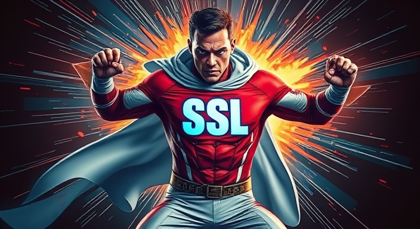

# Let's Encrypt SSL Certificate with Certbot for GoDaddy

Securing your website with HTTPS is a critical step in establishing trust and improving SEO. This guide will show how to generate and install a free Let's Encrypt SSL certificate on a GoDaddy-hosted site using Certbot, and set up automatic certificate renewal.



<!-- more -->

This guide will walk you through the steps to generate and install a Let's Encrypt SSL certificate on your GoDaddy-hosted website, including automating certificate renewal.

## Prerequisites

- A GoDaddy account with VPS or Dedicated Hosting ( ustom SSL certificates can be installed).
- SSH access to your hosting server. (Optional)
- Certbot installed on your local machine or server.


## Step 1: Install Certbot
To generate a Let's Encrypt SSL certificate, you'll need to install Certbot. Follow these steps based on your operating system.

For Ubuntu/Debian-based systems:

``` bash
sudo apt update
sudo apt install certbot
```

For macOS (using Homebrew):

``` bash
brew install certbot
```

## Step 2: Generate the SSL Certificate
To generate the SSL certificate, use Certbot's DNS validation method. This is particularly useful when you're hosting with GoDaddy but running Certbot elsewhere.

Run the following command, replacing yourdomain.com with your domain:
``` bash
certbot certonly --manual --preferred-challenges=dns -d yourdomain.com -d www.yourdomain.com
```

Certbot will prompt you to create a DNS TXT record to verify domain ownership.

Add the DNS TXT record in GoDaddy:

1. Log in to your GoDaddy account.
1. Go to Domains > DNS Settings.
1. Add a new TXT record with the value provided by Certbot (it will look something like _acme-challenge.yourdomain.com).
1. Wait for DNS propagation to complete (this can take a few minutes to a couple of hours).
1. Confirm the certificate: After DNS propagation, confirm the certificate generation by following the instructions provided by Certbot.

Certbot will generate the following files:
- fullchain.pem (certificate)
- privkey.pem (private key)

## Step 3: Install the Certificate on GoDaddy
1. Log in to your GoDaddy cPanel.
1. Go to Security > SSL/TLS.
1. Under Manage SSL Sites, click Manage SSL Sites.
1. Paste the content of:
    - fullchain.pem into the "Certificate" field.
    - privkey.pem into the "Private Key" field.
1. Click Install Certificate to complete the process.

## Step 4: Automate Renewal with Certbot
Let’s Encrypt certificates expire every 90 days, so it’s important to set up automatic renewal.

### Test the renewal process: 
Run the following command to test renewal:

``` bash
sudo certbot renew --dry-run
```
### Set up a cron job for automatic renewal:

To automatically renew your certificates, create a cron job that runs periodically (e.g., every day at midnight):
``` bash
sudo crontab -e
```
Add the following line to the cron file:

``` bash
0 0 * * * certbot renew --quiet && systemctl reload apache2  # For Apache
```
OR
``` bash
0 0 * * * certbot renew --quiet && systemctl reload nginx   # For Nginx
```

This ensures that certificates are checked and renewed daily, if necessary.

## Step 5: Verify SSL Installation
Once the certificate is installed, use the SSL Labs Test to verify your SSL certificate and check for any issues.

## Conclusion
By following this guide, you've successfully secured your GoDaddy-hosted website with a free Let's Encrypt SSL certificate. With automated renewal in place, you can now enjoy secure and hassle-free HTTPS for your site.
