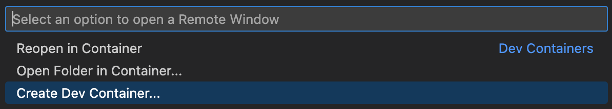
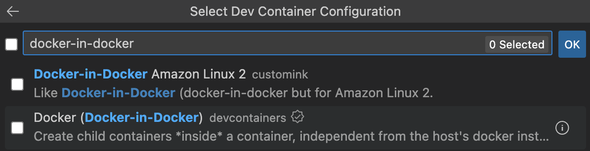

# Dev Container

## Background

Since my first job after college graduation, I have been looking for a way to setup a portable development environment for the following reasons:

1. to use it on multiple machines
1. to share it among the team with teammates who doesn't have server/platform/os experience
1. to standardize os, programming language and library version, etc
1. to save myself the headache of rebuilding everything from scratch

All throught these years, I have been using the following to achieve this:

1. Vmware/Virtualbox
1. Puppet
1. Docker

I thought the endgame would be docker since it is lightweight, scriptable and can be run almost anywhere, until I meet __Dev Container__.

## About Dev Container

Dev Container is a feature of VS Code and Docker, which provides an easy and reproducible way to set up development environments, within a button residing on the IDE. It can be used to run an application, to separate tools, libraries, or runtimes needed for working with a codebase

## Prerequisite 

1. VS Code
1. Docker

## To Create a Dev Container

As an example, I am going to create a Python 3.9 Dev Container with Docker in Docker (DIID) support

1. Click on the lower left green icon at the VS Code IDE
1. From the dropdown at the top portion of the VS Code, select `Create Dev Container`

1. Search for Python 3 and select `Python 3 devcontainers`

1. Select `Additional Options` and choose Python 3.9

1. Search for `docker-in-docker` and check the checkbox

1. Click OK

At this point, VS Code will pop up an information box about the creation of the new Dev Container. After that VS Code will restart in the Dev Container mode.


There you have it. You should be able to run your application inside the Dev Container with Python 3.9 now.


## Configuration file

The configuration of the new Dev Container is saved under `.devcontainer/devcontainer.json` file. Here is the content of the file.

``` json
// For format details, see https://aka.ms/devcontainer.json. For config options, see the
// README at: https://github.com/devcontainers/templates/tree/main/src/python
{
	"name": "Python 3",
	// Or use a Dockerfile or Docker Compose file. More info: https://containers.dev/guide/dockerfile
	"image": "mcr.microsoft.com/devcontainers/python:1-3.9-bookworm",
	"features": {
		"ghcr.io/devcontainers/features/docker-in-docker:2": {}
	}

	// Features to add to the dev container. More info: https://containers.dev/features.
	// "features": {},

	// Use 'forwardPorts' to make a list of ports inside the container available locally.
	// "forwardPorts": [],

	// Use 'postCreateCommand' to run commands after the container is created.
	// "postCreateCommand": "pip3 install --user -r requirements.txt",

	// Configure tool-specific properties.
	// "customizations": {},

	// Uncomment to connect as root instead. More info: https://aka.ms/dev-containers-non-root.
	// "remoteUser": "root"
}
```

## Link
[Dev Container](https://code.visualstudio.com/docs/devcontainers/containers)
[Github Repo](https://github.com/microsoft/vscode-dev-containers)